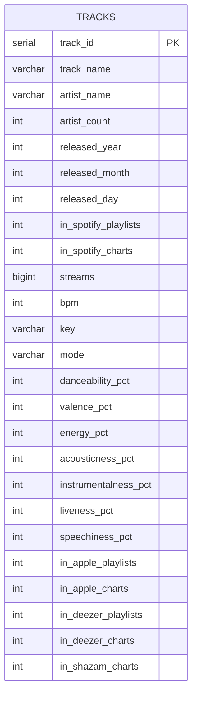

# Database Schema Diagram



## Table Description

### tracks
Bảng chính chứa thông tin về các bài hát, audio features và metrics từ các platform.

| Column | Type | Description |
|--------|------|-------------|
| `track_id` | SERIAL | Primary key, auto-increment |
| `track_name` | VARCHAR(500) | Tên bài hát |
| `artist_name` | VARCHAR(500) | Tên nghệ sĩ (có thể nhiều nghệ sĩ, phân cách bằng dấu phẩy) |
| `artist_count` | INTEGER | Số lượng nghệ sĩ tham gia |
| `released_year` | INTEGER | Năm phát hành |
| `released_month` | INTEGER | Tháng phát hành (1-12) |
| `released_day` | INTEGER | Ngày phát hành (1-31) |
| `streams` | BIGINT | Tổng số lượt stream trên Spotify |
| `bpm` | INTEGER | Beats per minute (tempo) |
| `key` | VARCHAR(10) | Musical key (C, C#, D, ..., B) |
| `mode` | VARCHAR(10) | Major hoặc Minor |
| `danceability_pct` | INTEGER | Độ phù hợp để nhảy (0-100%) |
| `valence_pct` | INTEGER | Độ tích cực/vui vẻ (0-100%) |
| `energy_pct` | INTEGER | Năng lượng/cường độ (0-100%) |
| `acousticness_pct` | INTEGER | Độ acoustic (0-100%) |
| `instrumentalness_pct` | INTEGER | Độ instrumental (0-100%) |
| `liveness_pct` | INTEGER | Độ live performance (0-100%) |
| `speechiness_pct` | INTEGER | Độ nói/rap (0-100%) |

### Cross-Platform Metrics

| Column | Description |
|--------|-------------|
| `in_spotify_playlists` | Số playlists trên Spotify chứa bài hát |
| `in_spotify_charts` | Số lần xuất hiện trên Spotify Charts |
| `in_apple_playlists` | Số playlists trên Apple Music |
| `in_apple_charts` | Số lần xuất hiện trên Apple Charts |
| `in_deezer_playlists` | Số playlists trên Deezer |
| `in_deezer_charts` | Số lần xuất hiện trên Deezer Charts |
| `in_shazam_charts` | Số lần xuất hiện trên Shazam Charts |

## Indexes

```sql
CREATE INDEX idx_tracks_artist ON tracks(artist_name);
CREATE INDEX idx_tracks_year ON tracks(released_year);
CREATE INDEX idx_tracks_streams ON tracks(streams DESC);
CREATE INDEX idx_tracks_year_month ON tracks(released_year, released_month);
```
